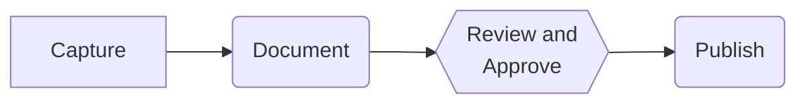

> ​	性能黄金法则(Performance Golden Rule)揭示了**只有10%~20%的最终用户响应时间花在接收所请求的HTML文档上剩下的80%~90%时间花在为HTML文档所引用的所有组件(图片、脚本、样式表Flash 等)进行的HTTP 请求上。**因此，改善响应时间的最简单途径就是减少组件的数量，并由此减少 HTTP 请求的数量
>

##     减少http请求

<!--more-->

1. 图片地图

	将一张图片做几张图片用，减少图片使用


	```html
	<p align="center">
	    
	
	    <map name="mymap1">
	
	    <area shape="rect" coords="47,36,209,275" href="a.html" alt="">
	
	    <area shape="rect" coords="271,36,433,275" href="b.html" alt="">
	
	    <area shape="rect" coords="487,36,668,275" href="c.html" alt="">
	    </map>
	</p>
	```

2. css Sprites

	雪碧图(图片精灵)，将一张多素材图片通过定位【background-position】方式，展示其中某一部分来模拟多张图片的效果。减少图片请求

	[雪碧图在线生成工具](https://code-nav.top/spritesmith)

3. 内联图片

	​	通过使用 dataLURL 模式 在web页面包含图片且无需额外http请求.Data URL协议中，图片被转换成[base64](https://so.csdn.net/so/search?q=base64&spm=1001.2101.3001.7020)编码的字符串形式，并存储在URL中，冠以mime-type。

	```css
	img {
	 background: url("data:image/gif;base64,R0lGODlhAwADAIAAAP///8zMzCH5BAAAAAAALAAAAAADAAMAAAIEBHIJBQA7");
	}
	```

	```html
	
	```

	​	使用Data URL方式的Demo在渲染时会比不使用 多消耗53%左右的CPU资源，内存多出4倍左右，耗时平均高出24.6倍 。由此可见，使用Data URl方式还是需要更多的考量，在可接受的范围内适量使用。

4. 合并脚本样式表

	减少 js,css 文件数量


## 使用内容发布网络

就是使用 cdn 加速，减少打包体积


## 添加 Expries 头

图片资源浏览器默认会进行缓存，非首次访问时会触发.

```shell
// 设置缓存存储的最大周期，超过这个时间缓存被认为过期 (单位秒)。与Expires相反，时间是相对于请求的时间。
Cache-Control: max-age=<seconds>
// 响应标头包含响应应被视为过期的日期/时间。无效的日期（比如 0）代表过去的日期，即该资源已经过期。
Expires: Wed, 21 Oct 2015 07:28:00 GMT
```

添加长的 Expires 头可以将后续页面浏览的响应时间从 600秒降低到260毫秒这是在900Kbps的DSL 上测试的，减少了57%。页面中的组件越多，响应时间改善得越多。如果你的页面平均超过6个图片、3个脚本和1个样式表，页面的速度提升就会超过这个例子中的57%。


## 压缩组件

可以用于向浏览器发布压缩的 web页面，从HTTP请求中的**Accept-Encoding**头来标识对压缩的 web 页面 。http从 1.1开始 对压缩标识支持

```
Content-Encoding:gzip
```

gzip 是目前最流行最有效的压缩方式，这是GNU项目开发的一种免费的格式

启用方式参考 **nignx 配置 gzip**

**vite vue3项目**

```js
import compressPlugin from 'vite-plugin-compression'
export default defineConfig({
    plugins: [
        ...,
        compressPlugin({
          threshold: 3072, //3KB 仅压缩文件大小大于此阈值的文件
          deleteOriginFile: false, // 是否删除原始文件
        }),
    ]
})

```

**vue cli 项目**

```js
const compressionWebpackPlugin = require("compression-webpack-plugin");
module.exports = {
  configureWebpack: {
    plugins: [
      // 开启gzip
      new compressionWebpackPlugin({
        filename: "[path][base].gz",
        algorithm: "gzip",
        test: /.js$|.css$|.html$/,
        threshold: 10240, // 对超过10k的数据压缩
        minRatio: 0.8 // 压缩率小于0.8才会压缩
      }),
   ]
}
```

当浏览器直接访问服务器时，一切都正常。如果浏览器通过代理来发送请求时，就可能出现问题。由于正向代理服务端缓存会根据第一次请求来决定，如果第一次请求URL，浏览器不支持gzip,那么第二次支持gzip浏览器请求URL 服务端会按不支持gzip 处理，反之浏览器不会解压.gz 文件。

```
Vary: Accept-Encoding, User-Agent
```

在服务端响应头 新增如上，就能避免问题，添加 user-Agent nginx可以根据浏览器是否支持gzip 判断是否返回 压缩的文件。

2024了 现在浏览器基本都支持，不需要考虑这个问题

## 外联 js, css

不使用内联 js,css, 将js,css 放置外部文件中

## 减少 DNS 查找

浏览器对级存的 DNS 记录的数也有限制，而不管缓存记录的时间。如果用户在短时间内访问了很多具有不同域名的网站，较早的 DNS 记录将被丢弃，必须重新查找该域名。

## 压缩精简代码

打包压缩

## 避免重定向

- 300Multiple Choices(基于 Content-Type)

	

- 301 Moved Permancently.

	客户请求的文档在其他地方，新的URL在 Location 头中给出，浏览器应该自动地访问新的URL。

- 302MovedTemporarily亦称Found)

	类似于301，但新的URL应该被视为临时性的替代，而不是永久性的。

- 303 See Oier 对302的说明)

	类似于301/302，不同之处在于，如果原来的请求是POST，Location头指定的重定向目标文档应该通过GET提取（HTTP 1.1新）。

- 304 Not Modified

	客户端有缓冲的文档并发出了一个条件性的请求（一般是提供If-Modified-Since头表示客户只想比指定日期更新的文档）。服务器告诉客户，原来缓冲的文档还可以继续使用。
	 如果客户端发送了一个带条件的 GET 请求且该请求已被允许，而文档的内容（自上次访问以来或者根据请求的条件）并没有改变，则服务器应当返回这个状态码。**304响应禁止包含消息体（因此304请求可以借助浏览器缓存来节省资源请求）**

- 305 Use Proxy

- 306(不使用)

- 307Temporary Redifeot(对302的说明)

	 如果这不是一个GET或者HEAD请求，那么浏览器禁止自动进行重定向，除非得到用户的确认，因为请求的条件可能因此发生变化。对于307，使用POST请求的话，重定向的请求应该是POST请求。 

[浅谈之-http的状态码以及使用场景](https://kebingzao.com/2018/10/05/http-status-code/)

## 配置或移除eTag

**条件get请求**

当缓存的组件过期了或重新加载页面，浏览器重用它们之前必须要确认它们是否任然有效。这称作一个条件请求。然而浏览器要产生一个get请求。如有效get返回状态304 Not Modified

向不同服务器




